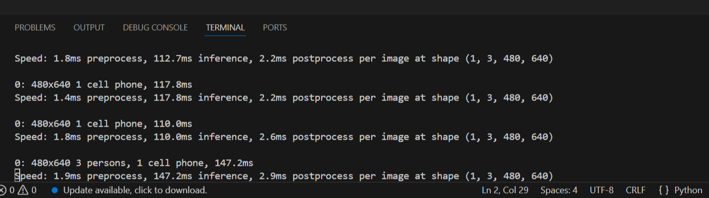

# YOLOv8 Object Detection

This project performs **real-time object detection** using a webcam with the help of **YOLOv8** and **OpenCV**.

---

## Features

* Real-time object detection using webcam
* Uses pretrained YOLOv8 model (`yolov8n.pt`)
* Displays bounding boxes around detected objects
* Press **'q'** to exit

---

## Project Structure

```
CodeAlpha_ObjectDetection/
│
├── outputs/
│   └── output.png
│
├── src/
│   └── object_detection.py
│
├── yolov8n.pt
├── requirements.txt
└── README.md
```

---

## Requirements

Install dependencies:

```bash
pip install -r requirements.txt
```

---

## How to Run

```bash
python src/object_detection.py
```

---

## How It Works

* OpenCV captures live video from webcam
* YOLOv8 model detects objects in each frame
* Detected objects are displayed with bounding boxes

---

## 🖼️ Output



---

## Technologies Used

* Python
* OpenCV
* YOLOv8 (Ultralytics)

---

## Author

Mahnoor Fatima
